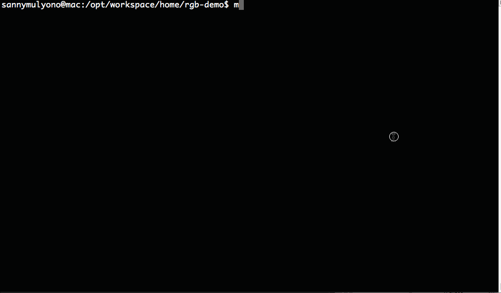

# Generator for Requirejs, Grunt and Backbone 
> Travis-CI build : [](https://travis-ci.org/smulyono/generator-rgb) 

> Drone.io build : [](https://drone.io/github.com/smulyono/generator-rgb/latest)

> Yeoman generators for scaffolding a lightweight and simple Backbone with AMD support (requirejs) which also includes
> grunt tasks for minifications and optimization. This generator is mainly collections of the grunt and workflows to scaffold :
> 
* Front-end site/webapp generator
* Backbone library/API module generator
* Unit test generator with Karma & Jasmine

## Features

* [x] Multi purpose Requirejs(AMD),Grunt scripts and Backbone based application generators. 
* [x] Bulding single deployable API module
* [x] Backbone with AMD (requirejs) supports
* [x] HTML5 template with modernizr
* [x] Less supports
* [x] Requirejs optimization script
* [x] Assets optimization (HTML, Javascript and CSS) and aggregation
* [x] Almond replacement on requirejs optimization
* [x] Unit test integrations (karma & jasmine support)
* [x] Support ES6 with Babel as transpiler. (*.es6 --> *.js)


## Getting Started

Make sure you have Yeoman installed : 
```bash
$ npm install -g yo
```

Then install rgb generators : 
```bash
$ npm install -g generator-rgb
```

You can also just link them for local installation:
```bash
$ npm link
```

__OK__, now we ready to start creating some apps. First, let's create directory and run generators from the directory : 
```bash
$ mkdir newApp && cd $_
$ yo rgb 
```

### Creating First application


### Running unit test

```bash
# Run all unit test
$ npm test

# With individual unit test
$ npm test -- -file=<specFile>

# Creating spec file
$ yo rgb
---> choose New Spec Test
```


### Other __npm__ tasks available

__For development__:
```bash
$ npm start
```

__For building with optimized scripts (output directory is build/)__:
```bash
$ npm run build
OR
$ grunt build
```

__For building the site/app as deployable Bower library or standalone (output directory is dist/)__:

The scaffolding will gives a pre-defined template on the Gruntfile which can be customized. Please look for ___INDIVIDUAL MODULE BUILD CONFIGURATION___ in Gruntfile. 

```bash
$ npm run build_component 
OR
$ grunt build_component 
```

__For running in production mode__:
```bash
$ npm run start_live
OR
$ grunt connect:live
```

__Working with ES6__:

To work with ES6, put any es6 files under app/**. Running in development will automatically watch for any es6 file changes and transpiled them into es5 (with .js extension).

* Work with requireJS [read here](https://medium.com/@kentcdodds/misunderstanding-es6-modules-upgrading-babel-tears-and-a-solution-ad2d5ab93ce0#.62m1pae90). 
    ```javascript
    var component = require('component').default;

    component.js
    export default class Component {}
    ```

* React transpiler is included by default


## License

__MIT__

